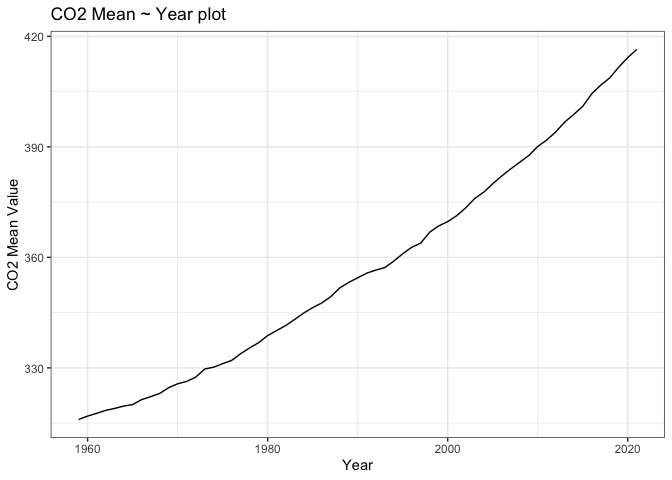

Case Study 08
================
Hang Tian
August 1, 2020

``` r
library(ggplot2)
suppressPackageStartupMessages(library(tidyverse))
dataurl="ftp://aftp.cmdl.noaa.gov/products/trends/co2/co2_annmean_mlo.txt"
temp=read_table(dataurl, skip=57,col_names = c('year','mean','unc'))
```

    ## 
    ## ── Column specification ────────────────────────────────────────────────────────────────────────────
    ## cols(
    ##   year = col_double(),
    ##   mean = col_double(),
    ##   unc = col_double()
    ## )

``` r
ggplot(temp,aes(year,mean))+
  geom_line()+
  theme_bw()+
  xlab('Year')+
  ylab('CO2 Mean Value')+
  ggtitle('CO2 Mean ~ Year plot')
```



``` r
library(dplyr)
processed=temp%>%arrange(desc(mean))%>%select(year,mean)%>%slice(1:5)
knitr::kable(processed,'simple')
```

| year |   mean |
|-----:|-------:|
| 2021 | 416.45 |
| 2020 | 414.24 |
| 2019 | 411.66 |
| 2018 | 408.72 |
| 2017 | 406.76 |

``` r
# rmarkdown::render("week_08/case_study_08.Rmd",output_format = "all")
```
